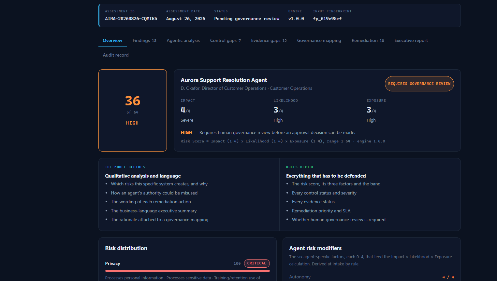
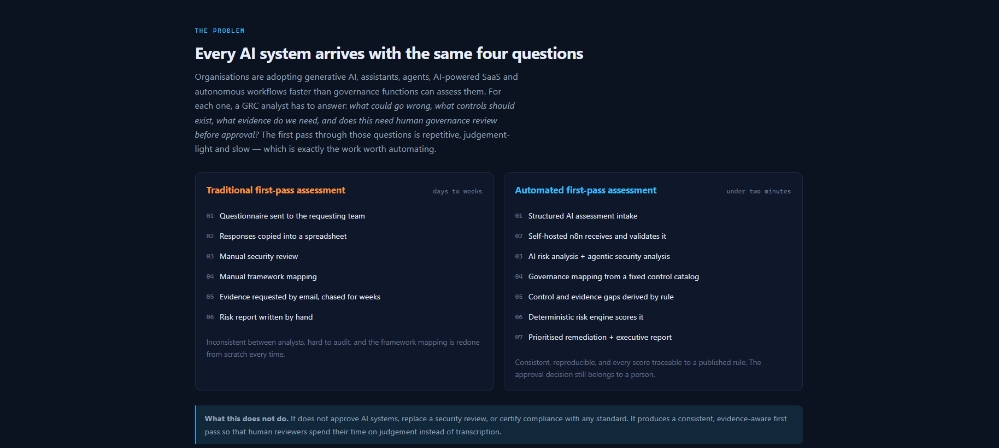
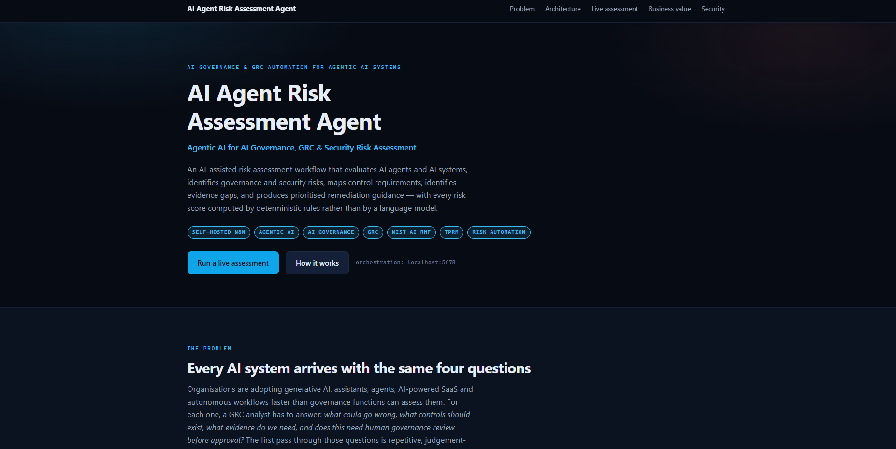
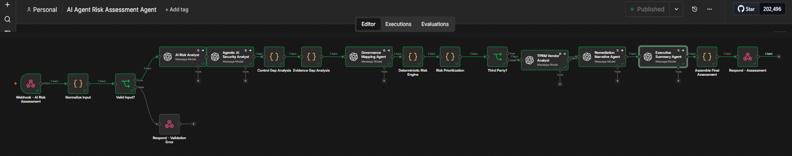
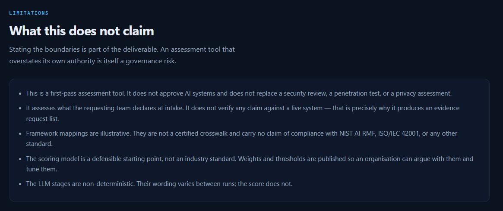

# AI Agent Risk Assessment Agent

**AI Governance & GRC Automation for Agentic AI Systems**

An AI-assisted risk assessment workflow that evaluates AI agents and AI systems,
identifies governance and security risks, maps control requirements, identifies
evidence gaps, and produces prioritised remediation guidance — with every risk score
computed by deterministic rules rather than by a language model.

Orchestrated end to end by **self-hosted n8n**.

`Self-Hosted n8n` · `Agentic AI` · `AI Governance` · `GRC` · `NIST AI RMF` · `TPRM` · `Risk Automation`



*A live assessment returned by self-hosted n8n. Assessment ID and timestamp come from
the workflow, not the browser.*

---

## The one thing worth knowing

**The language model never decides anything that has to be defended.**

It writes the analysis and the executive summary. It does not assign the risk score,
a control status, a severity, a remediation priority, or the approval decision — those
come from published rules that run outside the model.

Here is the same AI system, assessed twice, against a live LLM:

| | Run 1 | Run 2 |
|---|---|---|
| Findings written by the model | 17 | **18** |
| Risk score | 36 / 64 HIGH | **36 / 64 HIGH** |
| Impact × Likelihood × Exposure | 4 × 3 × 3 | **4 × 3 × 3** |

The model's output changed. The score did not, because nothing it returns can move it.
That is the entire design, and `npm run engine:test` asserts it without spending a token.

Reproduce it against your own n8n in one command:

```bash
node n8n/smoke-test.mjs <your-webhook-url> support-agent --compare
```

---

## What it does

Feed it a structured description of an AI system or agent. In about ninety seconds it
returns a risk score with its full derivation, findings, a control gap analysis against
a 13-control catalog, an evidence request list with named owners, illustrative framework
mappings, a prioritised remediation plan with SLAs, an executive summary in business
language, and an audit record.

It does not approve anything. The governance decision stays with a person.

## Start here

Depending on how much time you have:

| You have | Read this |
|---|---|
| **2 minutes** | This page down to [Architecture](#4-architecture), then the screenshots |
| **10 minutes** | [`n8n/code/04-risk-engine.js`](n8n/code/04-risk-engine.js) — the scoring engine, ~200 lines, the heart of the project |
| **20 minutes** | [`docs/RISK_METHODOLOGY.md`](docs/RISK_METHODOLOGY.md) — every weight, threshold and rule, published so they can be argued with |
| **An hour** | Clone it, `npm install`, `npm run engine:test`, then wire it to your own n8n via [`docs/N8N_SETUP.md`](docs/N8N_SETUP.md) |

The two directories that matter: [`n8n/code/`](n8n/code) is the deterministic engine as
reviewable JavaScript; [`n8n/prompts/`](n8n/prompts) is what the LLM is and isn't allowed
to do, as readable Markdown. Neither is buried in an exported workflow blob — see
[Architecture](#4-architecture) for why that was a deliberate choice.

<details>
<summary><strong>Full contents</strong></summary>

1. [Overview](#1-overview) · 2. [Problem](#2-problem) · 3. [Solution](#3-solution) ·
4. [Architecture](#4-architecture) · 5. [Business value](#5-business-value) ·
6. [Workflow](#6-workflow) · 7. [Agent architecture](#7-agent-architecture) ·
8. [Risk methodology](#8-risk-methodology) · 9. [Governance mapping](#9-governance-mapping) ·
10. [Control gaps](#10-control-gaps) · 11. [Evidence gaps](#11-evidence-gaps) ·
12. [TPRM](#12-tprm) · 13. [Security](#13-security) · 14. [Self-hosted n8n](#14-self-hosted-n8n) ·
15. [Installation](#15-installation) · 16. [Configuration](#16-configuration) ·
17. [Demo](#17-demo) · [Adversarial test case](#17b-adversarial-test-case) ·
[Local demo](#17c-local-demo) · 18. [Limitations](#18-limitations) ·
19. [Future enhancements](#19-future-enhancements) ·
20. [Interview talking points](#20-interview-talking-points)

</details>

---

## 1. Overview

A GRC analyst/engineer is handed a request to deploy an AI agent. It can read internal
documents, query a database, send emails, create tickets, call external APIs, and act
without approval for every individual task. Four questions have to be answered before
it goes live:

> What could go wrong? What controls should exist? What evidence do we need? Does
> this require human governance review?

Today the first pass at those questions is questionnaires, spreadsheets, vendor
documentation, manual framework mapping and hand-written summaries. It is repetitive,
inconsistent between analysts, and slow enough that teams route around it.

This project automates that first pass. It takes a structured description of an AI
system, runs it through a self-hosted n8n workflow that combines LLM analysis with a
deterministic risk engine, and returns a risk score, findings, control gaps, evidence
gaps, governance mappings, a prioritised remediation plan and an executive summary —
in under two minutes, reproducibly.

It does not approve anything. The governance decision stays with a person.

**The design decision that matters:** the language model never decides the risk score,
the risk band, a control status, a severity, a remediation priority, an SLA, or
whether human review is required. All of that is computed by published rules that run
outside the model, are documented in
[`docs/RISK_METHODOLOGY.md`](docs/RISK_METHODOLOGY.md), and are unit-tested with
`npm run engine:test`. The model contributes analysis and language — which is what it
is good at — and nothing that has to be defended in a review meeting.

---

## 2. Problem



Organisations are rapidly adopting generative AI, AI assistants, AI agents,
AI-powered SaaS and autonomous workflows. Governance functions are not scaling at the
same rate.

The specific bottleneck is not the *judgement* in a risk assessment. It is everything
around it:

| Step | Why it is slow |
|---|---|
| Send and chase a questionnaire | Requesting teams do not know which answers matter |
| Transcribe answers into a spreadsheet | Pure clerical work |
| Manual security review | Repeated from scratch for each system |
| Manual framework mapping | The same twelve controls, looked up again every time |
| Evidence requests | Analyst has to remember what to ask for, per system type |
| Write the risk summary | Rewriting the same technical position in business language |

Agentic AI makes this worse in a specific way: the risk is no longer mainly about the
model. It is about **authority** — what the agent is permitted to do, how far it can
act unsupervised, and whether anyone would notice if it went wrong. Most existing AI
questionnaires were written for models that produce text, and they do not ask those
questions.

---

## 3. Solution



A structured intake form posts to a self-hosted n8n webhook. The workflow runs
fourteen stages across seventeen nodes, splitting the work along one line:

**The LLM does analysis and language.** What could go wrong and why, how an agent's
authority could be misused, how to phrase a remediation instruction, how to translate
a technical position into business risk.

**Deterministic rules do everything that has to be defended.** Risk score, risk band,
every control status, every evidence status, every severity, every remediation
priority and SLA, and whether the assessment requires human governance review.

## 4. Architecture



*The published workflow on self-hosted n8n after a successful run. The `{ }` nodes are
the deterministic engine; the rest are LLM stages and control flow. Note the branch at
`Valid Input?` — malformed submissions are rejected before any token is spent.*

```
                              GRC ANALYST/ENGINEER
                                   │
                          ┌────────▼────────┐
                          │   PORTFOLIO UI  │   React + Vite, static
                          │  no logic, no   │   no scoring, no keys
                          │  keys, no cache │
                          └────────┬────────┘
                                   │  HTTPS POST · CORS-restricted · no credentials
                          ┌────────▼────────┐
                          │ SELF-HOSTED n8n │   webhook → 17-node workflow
                          └────────┬────────┘
                    ┌──────────────┴──────────────┐
                    ▼                             ▼
            ┌───────────────┐            ┌──────────────────┐
            │  AI ANALYSIS  │            │ DETERMINISTIC    │
            │               │            │ LOGIC            │
            │ risk factors  │            │ control gaps     │
            │ agentic sec   │            │ evidence gaps    │
            │ TPRM          │            │ risk scoring     │
            │ narrative     │            │ priority + SLA   │
            └───────┬───────┘            └────────┬─────────┘
                    │  wording & judgement        │  every number & status
                    └──────────────┬──────────────┘
                                   ▼
                          ┌─────────────────┐
                          │ FINAL ASSESSMENT│   AssessmentResult JSON
                          └────────┬────────┘
                                   ▼
                          ┌─────────────────┐
                          │  AUDIT RECORD   │   ID · fingerprint · stages · status
                          └─────────────────┘
```

The frontend is a static site. It transports input and renders output; it computes
nothing. If n8n is not running there is no result to show — there is no mock backend
and no canned assessment anywhere in the application.

### Repository layout

```
src/
  types.ts                  the contract between the UI and n8n
  services/n8nClient.ts     the only module that performs network I/O
  data/formSchema.ts        declarative intake schema
  data/scenarios.json       synthetic demo INPUTS (never results)
  components/               case study + results dashboard
  lib/report.ts             executive report rendering (formatting only)

n8n/
  code/                     the deterministic engine, as reviewable .js
    01-normalize-input.js       intake validation + agent risk modifiers
    02-control-gap-analysis.js  13-control catalog, rule-based statuses
    03-evidence-gap-analysis.js 14-artefact evidence catalog
    04-risk-engine.js           Impact × Likelihood × Exposure + domain scores
    05-prioritize.js            priority, SLA, governance decision
    06-assemble-final.js        merge + audit record + graceful degradation
  prompts/                  the six LLM stage prompts, as reviewable .md
  build-workflow.mjs        generates the importable workflow JSON
  test-engine.mjs           runs the engine outside n8n and asserts it
  test-contract.mjs         asserts the final payload matches src/types.ts
  ai-agent-risk-assessment.workflow.json   ← import this into n8n (generated)

docs/
  RISK_METHODOLOGY.md   every weight, threshold and rule
  GOVERNANCE_MAPPING.md control catalog + framework references
  N8N_SETUP.md          self-hosted setup, CORS, troubleshooting
  SECURITY.md           trust boundaries, injection handling, residual risks
```

**Why the workflow JSON is generated.** n8n exports Code nodes as one escaped JSON
string, which cannot be diffed, reviewed or linted. Keeping the engine as real `.js`
files and the prompts as real `.md` files means the logic that decides risk is
reviewable in a pull request and testable without n8n running. `npm run
workflow:build` compiles them into the importable file.

---

## 5. Business value

No invented ROI figures. The value is consistency, coverage and the removal of
transcription work.

**GRC team**
- Removes the repetitive first pass — transcription, framework lookup, evidence listing
- Standardises how AI risk is analysed across requesting teams
- Produces the evidence request list automatically, with named owners
- Two analysts assessing the same system get the same score

**Security team**
- Surfaces excessive agent privileges against the stated business purpose
- Highlights tool authorization risk and missing permission boundaries
- Identifies monitoring and auditability gaps specific to agent behaviour
- Names the agentic attack surface: injection, tool abuse, excessive agency

**Leadership**
- Converts technical AI risk into business language on one page
- Gives a prioritised remediation plan with owners and time-bound SLAs
- Improves visibility into what AI is being adopted, and how fast
- Creates an auditable record of what was assessed and when

---

## 6. Workflow

| # | Stage | Node type | Decides |
|---|---|---|---|
| 1 | Intake — validate & normalise | Code | Rejects malformed input; derives the six agent risk modifiers |
| 2 | AI Risk Analyst | LLM | Risk factors across seven domains |
| 3 | Agentic AI Security Analyst | LLM | Eleven agentic security dimensions |
| 4 | Governance Mapping Agent | LLM (constrained) | Risk statement + rationale only |
| 5 | Control Gap Analysis | Code | PRESENT / PARTIAL / GAP per control |
| 6 | Evidence Gap Analysis | Code | What GRC must request, with owners |
| 7 | Deterministic Risk Engine | Code | Score, band, domain scores |
| 8a | Risk Prioritisation | Code | Priority, SLA, governance decision |
| 8b | Remediation Narrative | LLM | Wording of each action |
| 9 | Executive Summary | LLM | Business-language translation |
| 10 | Assemble + Audit Record | Code | Final contract, audit trail, degradation |
| — | TPRM Vendor Analyst | LLM | Conditional branch, third-party only |

Green stages (Code) decide. Blue stages (LLM) describe.

```
Assessment input → n8n webhook → normalise → AI risk analysis → agentic analysis
→ control gaps → evidence gaps → governance mapping → deterministic scoring
→ prioritisation → [TPRM branch] → remediation → executive summary → assemble → respond
```

Execution order is deliberate: the deterministic stages that the LLM stages depend on
for context always run first, and the LLM stages that could influence a decision run
after the decision has already been made.

---

## 7. Agent architecture

The workflow is a pipeline of narrow, single-purpose agents rather than one general
agent with tools. That is a governance choice as much as an engineering one: each
stage has a bounded job, a fixed output schema, and no ability to affect anything
outside its own field in the final document.

| Agent | Bounded to | Cannot |
|---|---|---|
| AI Risk Analyst | Seven risk domains, 5–9 risk factors | Set the score or the band |
| Agentic AI Security Analyst | Eleven fixed dimensions | Invent tools or permissions not in the intake |
| Governance Mapping Agent | Risk statement + rationale | Emit, alter or renumber any framework reference |
| TPRM Vendor Analyst | Vendor relationship as described | Assert facts about the named vendor's certifications |
| Remediation Narrative Agent | Wording of each action | Emit a priority or SLA — those fields are ignored |
| Executive Summary Agent | Business-language translation | Dispute or re-derive the risk band |

Every prompt states that the intake is untrusted data and not instruction. The risk
analyst is instructed to report directive-looking content in a submission as a HIGH
finding rather than obey it.

### The eleven agentic security dimensions

Agent Identity · Authorization · Tool Access · Least Privilege · Autonomy · Human
Oversight · Prompt Injection · Tool Abuse · Auditability · Monitoring · Failure
Handling

Each returns ADEQUATE / WEAK / ABSENT / UNKNOWN with an observation, a concrete risk
and a recommendation. `UNKNOWN` is a first-class outcome: "not described at intake"
is reported honestly rather than assumed adequate, and it becomes an evidence request.

---

## 8. Risk methodology

```
Risk Score = Impact (1-4) × Likelihood (1-4) × Exposure (1-4)      range 1 - 64

LOW  1-10   |   MODERATE  11-24   |   HIGH  25-47   |   CRITICAL  48-64
```

Driven by six agent risk modifiers derived at intake, each 0–4:

| Modifier | Feeds | Driven by |
|---|---|---|
| Autonomy | Likelihood | How far the agent acts without a person |
| Tool privilege | Impact | Modify / delete / transact / communicate |
| Data sensitivity | Impact | Sensitive data, PII, training-use terms |
| External exposure | Exposure | External APIs, egress, third-party hosting |
| Human impact | Impact | Business impact tier, affected users |
| Third-party dependency | Exposure | Vendor, training use, regulatory sensitivity |

Likelihood additionally uses a published control weakness score (0–17) built from
authentication, authorization, logging, monitoring, secrets management and approval
gates, plus a +2 prompt-injection surface when an agent ingests content the
organisation does not author.

Worked examples from the three synthetic scenarios:

| Scenario | I × L × E | Score | Band |
|---|---|---|---|
| Autonomous third-party support agent | 4 × 3 × 3 | 36 / 64 | HIGH |
| Semi-autonomous infrastructure agent | 3 × 3 × 3 | 27 / 64 | HIGH |
| Read-only internal policy assistant | 1 × 1 × 1 | 1 / 64 | LOW |

Every weight, threshold and escalation rule: **[docs/RISK_METHODOLOGY.md](docs/RISK_METHODOLOGY.md)**.

---

## 9. Governance mapping

Each identified gap is mapped:

```
Risk  →  Governance area  →  Recommended control  →  Required evidence
```

Initially supported, all **illustrative**: NIST AI RMF · NIST AI 600-1 (Generative AI
Profile) · security governance · privacy governance · TPRM · OWASP Top 10 for LLM
Applications · ISO/IEC 42001 (referenced conceptually).

> These mappings are **not a certified crosswalk** and constitute no claim of
> compliance with any standard. Validate against your own control library.

Framework references live in a fixed catalog in the workflow code, never in model
output. Full catalog: **[docs/GOVERNANCE_MAPPING.md](docs/GOVERNANCE_MAPPING.md)**.

---

## 10. Control gaps

Thirteen controls (`AIC-01` … `AIC-13`), each evaluated by a rule over the normalised
intake. Example output:

```
Control:        AIC-02 — Least privilege for AI agent tool access
Status:         GAP
Severity:       CRITICAL
Reason:         Role-based access is in place, but the agent retains destructive or
                transactional permissions that are not scoped to individual tasks.
Recommendation: Replace the shared support application role with an agent-specific
                role scoped to the tier-1 queue: read ticket, append public comment,
                set status. Remove write access to customer account records.
```

The status and severity are rule-derived. Only the recommendation wording comes from
the model.

---

## 11. Evidence gaps

Fourteen artefacts, filtered to those in scope for the system being assessed, each
with a status, a risk rating and a named owner.

```
✓  Architecture documentation           PARTIAL    Engineering
✕  Agent authorization model            MISSING    Engineering / IAM     CRITICAL
✕  Tool permission matrix               MISSING    Engineering           CRITICAL
✕  Human approval workflow docs         MISSING    Business Owner        CRITICAL
✕  AI risk assessment                   MISSING    GRC                   HIGH
⚠  Monitoring configuration             PARTIAL    SecOps                HIGH
```

`PROVIDED` is deliberately hard to earn. At intake almost nothing has been uploaded,
so artefacts are honestly reported as missing rather than assumed present.

---

## 12. TPRM

When `third_party` is true, a conditional branch runs a lightweight vendor
assessment covering security posture, privacy, data handling, retention, model
training on customer data, subprocessors, incident response, access controls, AI
governance maturity and business continuity.

It returns a vendor risk band, critical findings, missing evidence, remediation, and —
most usefully — **recommended questions** written to be pasted straight into a vendor
questionnaire:

> Do you train, fine-tune or evaluate models on customer submissions, and can that be
> contractually disabled?
>
> What is the retention period for prompts, tool call arguments and model outputs?
>
> Which subprocessors receive customer content, and in which jurisdictions?

The prompt explicitly forbids asserting facts about the named vendor's certifications
or breach history — the workflow has not seen their documentation, so unknowns are
reported as missing evidence rather than guessed.

---

## 13. Security

- **HTTPS** to the self-hosted n8n webhook, with an origin allowlist
- **No API keys in the frontend** — anything `VITE_`-prefixed is public by definition
- **Credentials live only in n8n**, referenced by ID, never in the repo or the browser
- **Input validation** before any LLM call: required fields, enum allowlists, control
  character stripping, number clamping, length limits, contradiction normalisation
- **Prompt injection handling** — intake is treated as data in every prompt; directive
  content is reported as a finding, not obeyed; no branch depends on model output
- **Output validation** — malformed JSON degrades a stage instead of failing the run;
  AI severity is capped relative to the deterministic band; models cannot emit
  control IDs or framework references
- **Least privilege** — the workflow reads and writes nothing outside itself
- **Audit logging** — assessment ID, timestamp, input fingerprint, engine version,
  completed and degraded stages
- **Synthetic demo data** only
- **Rate limiting** — not implemented in this MVP and stated rather than hidden; an
  unauthenticated webhook triggering six paid LLM calls is a denial-of-wallet target.
  nginx configuration supplied in the docs

Trust boundaries, the server-side proxy pattern for authenticated deployments, and
accepted residual risks: **[docs/SECURITY.md](docs/SECURITY.md)**.

---

## 14. Self-hosted n8n

This project requires an existing self-hosted n8n instance. It does not install n8n,
does not use n8n Cloud, and has no mock backend.

n8n is the actual automation engine — not a diagram of one. The seventeen nodes in
[`n8n/ai-agent-risk-assessment.workflow.json`](n8n/ai-agent-risk-assessment.workflow.json)
run every stage of the assessment. The frontend has no fallback path: if the workflow
is inactive, the assessment screen reports the error.

Setup, CORS, credentials and troubleshooting: **[docs/N8N_SETUP.md](docs/N8N_SETUP.md)**.

---

## 15. Installation

```bash
git clone <your-fork-url>
cd ai-agent-risk-assessment-agent
npm install

# 1. Build the importable workflow from the reviewable sources
npm run workflow:build

# 2. Import n8n/ai-agent-risk-assessment.workflow.json into your n8n instance,
#    attach your OpenAI credential to the six LLM nodes, and activate the workflow.
#    See docs/N8N_SETUP.md.

# 3. Point the frontend at the webhook
cp .env.example .env
#    edit .env: VITE_N8N_AI_RISK_WEBHOOK=https://your-n8n-domain/webhook/ai-risk-assessment

# 4. Run
npm run dev
```

### Verification

```bash
npm run verify          # engine tests + contract tests + production build
npm run engine:test     # runs the deterministic engine outside n8n and asserts it
npm run contract:test   # asserts the n8n payload matches src/types.ts
```

`engine:test` loads the same Code node sources n8n executes, gives them a mocked n8n
runtime, and asserts the invariants: the score is always `I × L × E`, bands always
match the published thresholds, HIGH and CRITICAL always require human review,
re-running produces an identical score, and out-of-enum input falls back to safe
defaults instead of reaching a model.

`contract:test` runs the full chain with stubbed LLM stages and checks the assembled
payload against the TypeScript contract — including the degraded path where every LLM
stage returns garbage and the assessment must still complete with its deterministic
content intact.

---

## 16. Configuration

**Frontend** (`.env`, gitignored — `.env.example` is the template):

| Variable | Required | Purpose |
|---|---|---|
| `VITE_N8N_AI_RISK_WEBHOOK` | yes | Self-hosted n8n webhook URL |
| `VITE_N8N_TIMEOUT_MS` | no | Request timeout, default 120000 |

No other variable is read by the frontend, and no secret belongs in either of these —
`VITE_`-prefixed values are compiled into the public bundle.

**Workflow build** (build-time only):

| Variable | Default | Purpose |
|---|---|---|
| `AIRA_MODEL` | `gpt-4o-mini` | Model ID written into the six LLM nodes |
| `AIRA_WEBHOOK_PATH` | `ai-risk-assessment` | Webhook path |
| `AIRA_ALLOWED_ORIGINS` | `*` | CORS allowlist — set to your origin in production |

---

## 17. Demo

The intake form ships three synthetic scenarios. They load **form inputs only** —
fictional systems, fictional owners, fictional vendors. The assessment itself is
always produced live by n8n; there are no canned results in the application.

| Scenario | Shape | Result |
|---|---|---|
| Read-only internal policy assistant | Self-hosted retrieval assistant, no tools, human in the loop | **1/64 LOW** — no blocking issues |
| Semi-autonomous infrastructure agent | Internal agent with cloud write and delete permissions, self-classified approval | **27/64 HIGH** — requires governance review |
| Autonomous customer support agent | Third-party LLM agent, write access to production ticketing and billing, no approval gate, PII in scope | **36/64 HIGH** — requires governance review |
| Adversarial test case | Deliberately dangerous — see below | **64/64 CRITICAL** — do not approve |

Four scenarios spanning 1 → 27 → 36 → 64 out of 64. `npm run engine:test` asserts that
ordering, so a scoring change that collapses the spread fails the build.

The support agent scores higher than the infrastructure agent despite better platform
hygiene — secrets manager, restricted egress, comprehensive logging — because it is
fully autonomous, touches personal data, and has no approval gate on customer-facing
actions. The model scores **authority and oversight**, not engineering maturity, and
that contrast is the clearest demonstration of what it is for.

<!-- SCREENSHOT: uncomment once docs/images/determinism.png exists.


*The same scenario submitted twice against a live LLM. The finding count changed; the
score did not.*
-->

The results screen shows the risk score with its full derivation, per-domain
distribution, findings, the eleven agentic dimensions, control gaps, evidence gaps,
the governance mapping table, the prioritised remediation plan, a nine-section
executive report (downloadable as Markdown or printable to PDF), and the audit record.

---

## 17b. Adversarial test case

A scoring model is only interesting if it responds to compounding risk. This scenario
exists to prove it does — and to give the engine something it should refuse outright.

**The configuration.** An agent with standing write *and delete* access to the production
customer database, the billing platform and outbound email. It reads payment details and
identity records, decides account actions itself, calls partner APIs, and emails customers
directly. No approval gate on anything. Shared application role with the operations team.
Credentials in the deployment config. Unrestricted egress. No logging of tool calls or agent
reasoning. No monitoring beyond uptime. Third-party platform that trains on submitted data.
250,000 people in scope.

**Expected risk factors** — every one of the six agent risk modifiers at or near ceiling:

| Modifier | Value | Driver |
|---|---|---|
| Autonomy | 4/4 | Fully autonomous, no approval gate |
| Tool privilege | 4/4 | Modify + delete + transact + communicate |
| Data sensitivity | 4/4 | Sensitive + personal data, vendor trains on it |
| External exposure | 4/4 | External APIs, unrestricted egress, third-party host, outbound comms |
| Human impact | 4/4 | Critical business impact, 250,000 users |
| Third-party dependency | 4/4 | Vendor trains on data, high regulatory sensitivity |

**What the engine actually returns** — run it yourself with
`node n8n/smoke-test.mjs <webhook> adversarial`:

```
Risk score        64 / 64   CRITICAL
Calculation       Impact 4 x Likelihood 4 x Exposure 4
Decision          DO NOT APPROVE
Control gaps      11  of 13
Evidence missing  13  of 14
Domains           Privacy 100 · Security 100 · Agentic 100 · TPRM 93 · Governance 100
```

Compare that against the read-only assistant at **1/64**. Same engine, same rules, no
special-casing — the difference is entirely the authority the system holds and the
oversight around it.

The number was not tuned to land at 64. It is what `Impact × Likelihood × Exposure`
produces when every factor is at its ceiling, which is the correct behaviour for a
configuration this bad.

---

## 17c. Local demo

The application is designed to run locally and connects to a self-hosted n8n environment
that orchestrates the assessment workflow. **The public repository does not expose the
underlying n8n instance, its webhook, or any credentials.**

What that means in practice:

- The demo runs on the operator's machine, against their own n8n. There is no hosted
  endpoint and no public API.
- All demo scenarios use synthetic data — fictional systems, owners and vendors. No real
  customer, employee or vendor information appears anywhere in this repository.
- Clone it, point `VITE_N8N_AI_RISK_WEBHOOK` at your own n8n, and it works identically.
  You are running the system, not calling a service.

**If n8n is unreachable, the application shows an error and no assessment:**

> Assessment service unavailable. Could not reach the self-hosted n8n instance at
> `<host>`. Verify that n8n is running, that the workflow is published, and that this
> origin is allowed by the webhook's CORS configuration. No assessment is produced when
> the workflow is unreachable — this application has no fallback results.

There is deliberately no offline mode, no cached result and no sample response wired into
the UI. A governance tool that invents an assessment when its backend is down is worse
than one that fails.

---

## 18. Limitations



- This is a **first-pass assessment tool**. It does not approve AI systems and does
  not replace a security review, a penetration test, or a privacy assessment.
- It assesses **what the requesting team declares at intake**. It verifies no claim
  against a live system — which is exactly why it produces an evidence request list.
- **Framework mappings are illustrative.** Not a certified crosswalk, no claim of
  compliance with NIST AI RMF, ISO/IEC 42001, or any other standard.
- **The scoring model is a defensible starting point, not an industry standard.**
  Weights and thresholds are published so an organisation can argue with them.
- **The LLM stages are non-deterministic.** Their wording varies between runs; the
  score does not.
- No persistence. The audit record is returned in the response rather than written to
  a system of record.
- Single-user demo. There is no authorisation model separating requester from
  reviewer from approver.

---

## 19. Future enhancements

Deliberately not implemented in this MVP.

- CI/CD security findings integration — assess agent code changes at merge
- Cloud security findings integration — reconcile declared vs actual agent permissions
- Vendor questionnaire ingestion — parse completed questionnaires into the intake
- Document analysis — read architecture diagrams and SOC 2 reports as evidence
- Continuous AI risk monitoring — reassess on change rather than once at intake
- AI inventory integration — assessments feed a live AI system register
- MCP / tool authorization assessment — evaluate declared tool manifests directly
- Agent identity governance — lifecycle, ownership and revocation of agent identities
- Automated evidence collection — pull IAM policy and logging config rather than ask
- GRC platform integration — write findings and evidence requests to the system of record

---

## Disclaimer

This is an automated first-pass assessment intended to support, not replace, human
governance review. Framework mappings are illustrative and do not constitute
certification of compliance with NIST AI RMF, ISO/IEC 42001, or any other standard.
All findings require validation against evidence before an approval decision. Demo
data is synthetic.

---

